<!-- omit in toc -->
# 2023-01-25  SecurityHub情報収集

本資料は、Well-Architecedと連携するSecurityHubの有効化、無効化、および
SecurityHubの情報をテキストファイルへ出力するための操作手順である。

## 前提条件、制約事項

## 手順[想定作業時間: 10分]

### 1. ログイン

1. [AWSマネージメントコンソールのURL](https://console.aws.amazon.com/console/home)をクリックする。
2. 以下の必要な情報を入力して`サインイン`をクリックする。
    1. アカウントID: `?????????`
    2. ユーザー名: `xxxxxxxx`
    3. パスワード: `自分のIAMユーザーのパスワード`
3. MFAコードを入力し、`送信`をクリックする。
4. マネジメントコンソール上部に、**AWS マネジメントコンソール**を大きく表示されることを確認する。

### 2. Security Hub 有効化

1. AWSマネジメントコンソール」画面上部のナビゲーションバーより「Security Hub」を検索し、Security Hubコンソール画面を表示する。  
 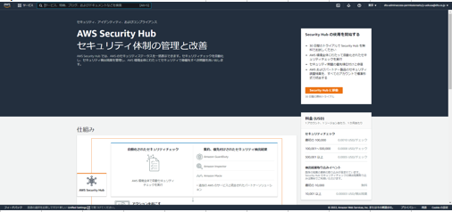  
     1.「Security Hubに移動」を選択する。  
        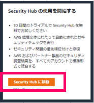  
     2.「AWS Security Hubの有効化」画面が表示されること。  
        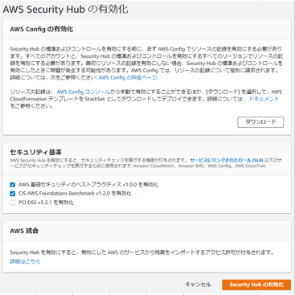  
     3.「セキュリティ基準」欄より、『AWS 基礎セキュリティのベストプラクティス v1.0.0を有効化」のみにチェックを入れた状態で「Security Hubの有効化」を選択する。  
        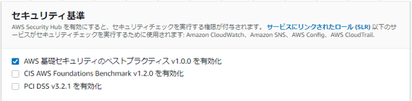  
        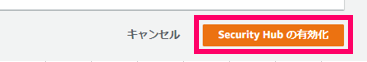  
     4.Security Hubの概要画面（ダッシュボード）が表示されること。  
        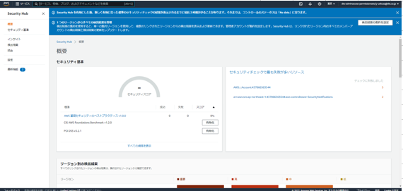  
     5. 左ペインより「セキュリティ基準」を選択する。  
     6.「セキュリティ基準」画面が表示され、「AWS 基礎セキュリティのベストプラクティス v1.0.0」のみ有効化されていること。  
        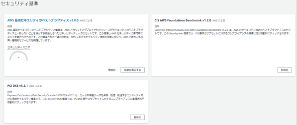  
     7. ※有効化には数分時間がかかるため以下画面が表示される場合がありますが、数分後に画面更新し確認すること。  
        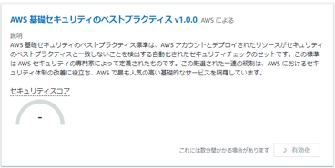
  
### 3. Security Hub情報取得作業

1. 「AWSマネジメントコンソール」画面上部のナビゲーションバーより「Security Hub」を検索し、Security Hubコンソール画面を表示する。  
 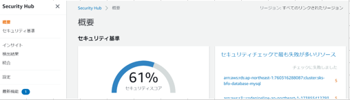  
    1.「セキュリティ基準」をクリックする。  
 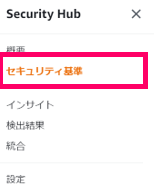  
    2. セキュリティ基準の画面に遷移する。  
 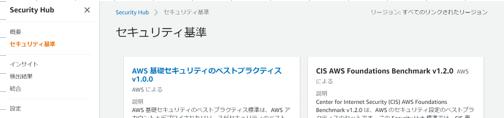  
    3.「セキュリティ基準」画面で「AWS基礎セキュリティのベストプラクティス v1.0.0」の「結果を表示する」をクリックする。  
 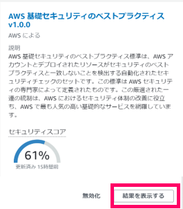  
    4.「AWS基礎セキュリティのベストプラクティスv1.0.0」画面に遷移する。  
 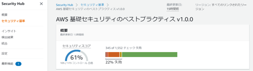  
    5.「AWS基礎セキュリティのベストプラクティスv1.0.0」画面で画面を下にスライドして、「ダウンロード」をクリックする。  
 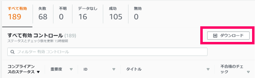  
    6. ブラウザの機能でファイルのダウンロードが開始され、端末上にファイルがダウンロードされることを確認する。  
※ダウンロード開始は数分時間がかかります。

### 4. Security Hub 無効化

1. AWSマネジメントコンソール」画面上部のナビゲーションバーより「Security Hub」を検索し、Security Hubコンソール画面を表示する。  
 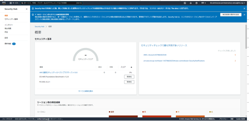  
     1.左ペインより「設定」を選択し、「設定」画面の「一般」タブを選択する。  
        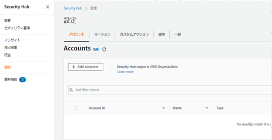  
     2.「一般」タブを選択し、「AWS Security Hubの無効化」欄の「AWS Security Hubの無効化」を選択する。  
        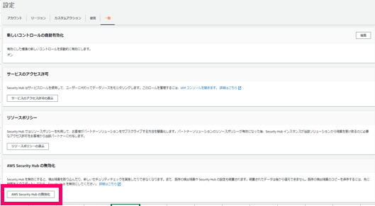  
     3.「AWS Security Hubの無効化」を選択する。  
        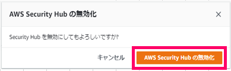  
     4.Security Hubの有効化前のコンソール画面が表示されることを確認する。  
        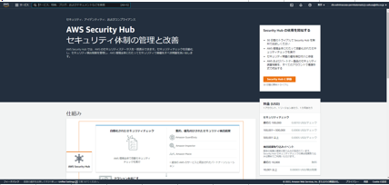  

### 参考情報

Security Hub有効化
<https://docs.aws.amazon.com/ja_jp/securityhub/latest/userguide/securityhub-enable.html>
Security Hub情報取得
<https://docs.aws.amazon.com/securityhub/latest/userguide/securityhub-standards-view-controls.html#securityhub-standards-download-controls>
Security Hub無効化
<https://docs.aws.amazon.com/ja_jp/securityhub/latest/userguide/securityhub-disable.html>
