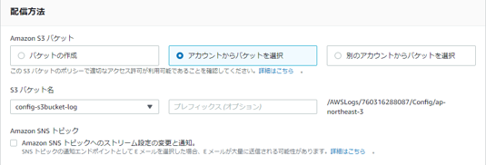

<!-- omit in toc -->
# 2023-01-25  SecurityHub有効化

当、手順書ではAWS　ConfigとAWS Security HubをWell-Architecedに連携する。
連携には下記前提条件がある。  
①Security Hubを利用するためにはAWS Configを有効にする必要がある。  
②AWS Configを有効とする前に記録用のS3バケットを作成するが必要がある。  
※S3バケットが作成済みの場合、AWS Configがすでに有効化されている場合は、
未対応の箇所よりスタートすること。

## SecurityHub有効化フロー図

```flow

st=>start
en=>end

tsk1=>operation: 記録用S3バケット作成

tsk2=>operation: AWS Config有効化

tsk3=>operation: AWS SecurityHub有効化

st->tsk1->tsk2->tsk3->en

```

## 手順[想定作業時間: 10分]

### 1. ログイン

1. [AWSマネージメントコンソールのURL](https://console.aws.amazon.com/console/home)をクリックする。
2. 以下の必要な情報を入力して`サインイン`をクリックする。
    1. アカウントID: `?????????`
    2. ユーザー名: `xxxxxxxx`
    3. パスワード: `自分のIAMユーザーのパスワード`
3. MFAコードを入力し、`送信`をクリックする。
4. マネジメントコンソール上部に、**AWS マネジメントコンソール**を大きく表示されることを確認する。

### 3. 記録用S3バケット作成

1. 「AWSマネジメントコンソール」画面上部のナビゲーションバーより「S3」を検索し、S3コンソール画面を表示する。  
   
    1.「バケットを作成」を選択する。  
   
    2.「AWS S3 設定」画面が表示されること。  
   
    3.「一般的な設定」は下記を選択する。  
    - 「バケット名」→ 任意に命名。
    - 「AWSリージョン」→「東京」を選択する。
   

    4.「オブジェクト所有者」は下記を選択する。
    - 「ACL無効(推奨)」を選択する。
   

    5.「このバケットのブロックパブリックアクセス設定」を選択する。
    - 規定値のままとする。  
   

    6.「バケットのバージョニング」「タグ」「デフォルト暗号」「詳細設定」は規定値のままとする。
   
    7.「バケットを作成」を押下する。
   

    8.S3バケット作成完了。  
   </BR></BR>

2. 「バケットポリシー」を設定する。「バケット」の画面より、上記で作成したバケットを選択する。
   
    1.「バケットの詳細画面」が表示されること。  
   
    2.「アクセス許可」タブを押下する。  
   
    3.「バケットポリシー」の「編集」ボタンを押下すること。  
   
    4.「バケットポリシーを編集」の編集箇所にバケットポリシーを入力する。
   
    5.下記ポリシー内容を入力する。

    ```txt
      {
        "Version": "2012-10-17",
        "Statement": [
          {
            "Sid": "AWSConfigBucketPermissionsCheck",
            "Effect": "Allow",
            "Principal": {
           "Service": "config.amazonaws.com"
            },
            "Action": "s3:GetBucketAcl",
            "Resource": "arn:aws:s3:::config-s3bucket-log",
            "Condition": { 
              "StringEquals": {
                "AWS:SourceAccount": "760316288087"
              }
            }
          },
         {
            "Sid": "AWSConfigBucketExistenceCheck",
            "Effect": "Allow",
           "Principal": {
              "Service": "config.amazonaws.com"
            },
            "Action": "s3:ListBucket",
            "Resource": "arn:aws:s3:::config-s3bucket-log",
            "Condition": { 
              "StringEquals": {
                "AWS:SourceAccount": "760316288087"
              }
            }
          },
          {
            "Sid": "AWSConfigBucketDelivery",
            "Effect": "Allow",
            "Principal": {
              "Service": "config.amazonaws.com"
            },
            "Action": "s3:PutObject",
            "Resource": "arn:aws:s3:::config-s3bucket-log/AWSLogs/760316288087/Config/*",
            "Condition": { 
              "StringEquals": { 
                "s3:x-amz-acl": "bucket-owner-full-control",
                "AWS:SourceAccount": "760316288087"
              }
            }
          }
        ]
      }
    ```  

    6.「ポリシー内容」を入力すること。
   
    7.「変更の保存」を押下する。
   

    8.バケットポリシー変更完了。  
   

### 4. AWS Config有効化

1. 「AWSマネジメントコンソール」画面上部のナビゲーションバーより「Config」を検索し、Configコンソール画面を表示する。  
   
    1.「今すぐ始める」を選択する。  
   
    2.「AWS Config 設定」画面が表示されること。  
   
    3.一般設定は下記を選択する。  
    - 「記録するリソースタイプ」→「このリージョンでサポートされているすべてのリソースを記録します」
    - 「グローバルリソース (AWS IAM リソースなど) を含める」にチェックを入れる。
    - 「AWS Config ロール」→「既存の AWS Config サービスにリンクされたロールを使用」
   

    4.配信方法は下記を選択する。
    - 「Amazon S3 バケット」→「アカウントからバケットを選択」を選択する。
    - 「S3 バケット名」→任意のバケット名を入力  ※記録用S3バケットで作成したバケット名を指定する。  
      ※ここでは例として「config-s3bucket-log」を入力する。
    - 「Amazon SNS トピック」はチェックしない
   

    5.「次へ」を押下する。  
   

    6.「ルール」選択画面では何も選択せず、そのまま「次へ」を押下する。
   
    7.レビュー画面にて、すべてのリソースが「グローバルリソースを含む」であることと確認し、「確認」を押下する。
   </BR></BR>

2. AWS Config でリソースの記録が有効化となる。
   
    1.AWS Config　ダッシュボードが表示されること。 
   

### 5. AWS Security Hub 有効化

1. AWSマネジメントコンソール」画面上部のナビゲーションバーより「Security Hub」を検索し、Security Hubコンソール画面を表示する。  
   
     1.「Security Hubに移動」を選択する。  
          
     2.「AWS Security Hubの有効化」画面が表示されること。  
          
     3.「セキュリティ基準」欄より、『AWS 基礎セキュリティのベストプラクティス v1.0.0を有効化」のみにチェックを入れた状態で「Security Hubの有効化」を選択する。  
          
          
     4.Security Hubの概要画面（ダッシュボード）が表示されること。  
          
     5. 左ペインより「セキュリティ基準」を選択する。  
     6.「セキュリティ基準」画面が表示され、「AWS 基礎セキュリティのベストプラクティス v1.0.0」のみ有効化されていること。  
          
     7. ※有効化には数分時間がかかるため以下画面が表示される場合があるが、数分後に画面更新し確認すること。  
        
  
### 参考情報

Amazon S3 の開始方法
<https://docs.aws.amazon.com/ja_jp/AmazonS3/latest/userguide/GetStartedWithS3.html>
コンソールによる AWS Config の設定
<https://docs.aws.amazon.com/ja_jp/config/latest/developerguide/gs-console.html>
Security Hub有効化  
<https://docs.aws.amazon.com/ja_jp/securityhub/latest/userguide/securityhub-enable.html>  
AWS Configの有効化に失敗します。どうすればよいですか  
<https://aws.amazon.com/jp/premiumsupport/knowledge-center/recreate-config-delivery-channel/>  
