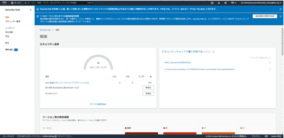

<!-- omit in toc -->
# 2023-01-27  SecurityHub無効化

当、手順書ではAWS　ConfigとAWS Security HubをWell-Architecedに
連携した状態より、連携を解除する手順を記す。  
無効化手順は有効化手順と逆の順番にて行う。 　

## SecurityHub無効化フロー図

```flow

st=>start
en=>end

tsk1=>operation: AWS SecurityHub無効化

tsk2=>operation: AWS Config無効化

tsk3=>operation: 記録用S3バケット削除

st->tsk1->tsk2->tsk3->en

```

## 手順[想定作業時間: 10分]

### 1. ログイン

1. [AWSマネージメントコンソールのURL](https://console.aws.amazon.com/console/home)をクリックする。
2. 以下の必要な情報を入力して`サインイン`をクリックする。
    1. アカウントID: `?????????`
    2. ユーザー名: `xxxxxxxx`
    3. パスワード: `自分のIAMユーザーのパスワード`
3. MFAコードを入力し、`送信`をクリックする。
4. マネジメントコンソール上部に、**AWS マネジメントコンソール**を大きく表示されることを確認する。

### 2. AWS Security Hub 無効化

1. 「AWSマネジメントコンソール」画面上部のナビゲーションバーより「Security Hub」を検索し、Security Hubコンソール画面を表示する。  
   
     1.左ペインより「設定」を選択し、「設定」画面の「一般」タブを選択する。  
     「設定」画面が表示されること。  
          
     2.「一般」タブを選択し、「AWS Security Hubの無効化」欄の「AWS Security Hubの無効化」を選択する。  
          
     3.「AWS Security Hubの無効化」ウインドウが表示されること。  
          
     4.「AWS Security Hubの無効化」を選択する。  
          
     5. Security Hubの有効化前のコンソール画面が表示されること。  
          

### 3. AWS Config無効化

1. 「AWSマネジメントコンソール」画面上部のナビゲーションバーより「cloudshell」を検索し、cloudshellコンソール画面を表示する。  
   
    1.現在設定されているConfigを確認する。  

      ```txt
      aws configservice describe-delivery-channels --region ap-northeast-1
      ```  

      を入力し実行する。  
      「記録用S3バケット名」画面が表示されること。  
   
    2.configを無効化する。
      下記コマンドをcloudshellより実行する。

      ```txt
      for r in `aws ec2 describe-regions --query Regions[*].RegionName --output text`
      do
    for channel_name in `aws configservice describe-delivery-channels --region $r --query DeliveryChannels[*].name --output text`
    do 
        recorder_name=`aws configservice describe-configuration-recorders --region $r --query ConfigurationRecorders[*].name --output text`
        aws configservice delete-configuration-recorder --configuration-recorder-name $recorder_name --region ap-northeast-1
        aws configservice delete-delivery-channel --delivery-channel-name $channel_name --region ap-northeast-1
       done
     done
      ```

    3.cloudshell画面にてメッセージは表示されず、プロンプトが戻るのみ。  
   
    4.現在設定されているConfigを確認する。  

      ```txt
      aws configservice describe-delivery-channels --region ap-northeast-1
      ```
  
      を入力し実行する。  
      「記録用S3バケット名」画面がなくなっていること。  
   

    5.「AWSマネジメントコンソール」画面上部のナビゲーションバーより「Config」を検索する。  
    Configコンソールに「AWS　Confugのセットアップ」が表示されること。  
    AWS Config　ダッシュボードが表示できないこと。  
   

### 4. 記録用S3バケット削除

1. 「AWSマネジメントコンソール」画面上部のナビゲーションバーより「S3」を検索し、S3コンソール画面を表示する。  
   
    1.「バケットを作成」を選択する。  
   
    2.削除対象のバケット名左にあるラジオボタンを押下する。  
     「空にする」ボタンが活性化するので押下する。  
   
    3.「バケットを空にする」の詳細画面が表示されること。  
   

    4.テキストボックスに「完全に削除」と入力すると、「空にする」ボタンが活性化するので押下する。  
   

    5.バケットが空になること。  
   

    6.左ペインより「バケット」を選択する。  
    削除対象のバケット名左にあるラジオボタンを押下する。  
    「削除」ボタンが活性化するので押下する。  
   
    7.「バケットを削除」の詳細画面が表示されること。  
   

    8.テキストボックスに削除対象のバケット名を入力すると、「バケットを削除」ボタンが活性化するので押下する。  
   
    9.バケットが削除されたこと。  
   </BR></BR>

### 参考情報

Security Hub無効化  
<https://docs.aws.amazon.com/ja_jp/securityhub/latest/userguide/securityhub-disable.html>  

AWS Config データの削除  
<https://docs.aws.amazon.com/ja_jp/config/latest/developerguide/delete-config-data-with-retention-period.html>  

オブジェクトとバケットを削除する  
<https://docs.aws.amazon.com/ja_jp/AmazonS3/latest/userguide/deleting-object-bucket.html>  
