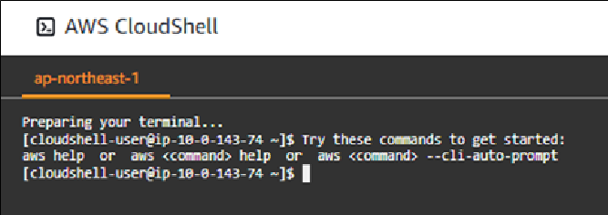

<!-- omit in toc -->
# 2023-01-16  ConfigRules情報収集

## 1. このドキュメントの目次

- [1. このドキュメントの目次](#1-このドキュメントの目次)
- [2. 前提条件](#2-前提条件)
- [3. 作業者](#3-作業者)
- [4. 副作業者 (チェッカー)](#4-副作業者-チェッカー)
- [5. その他制約事項・備考](#5-その他制約事項備考)
- [6. 参考情報](#6-参考情報)
- [7. 手順書\[想定作業時間: 10分\]](#7-手順書想定作業時間-10分)
  - [1. ログイン](#1-ログイン)
  - [2. ConfigRules情報取得作業](#2-configrules情報取得作業)

## 2. 前提条件

- Config適合パックが1件以上デプロイされていること。

## 3. 作業者

## 4. 副作業者 (チェッカー)

## 5. その他制約事項・備考

## 6. 参考情報

## 7. 手順書[想定作業時間: 10分]

### 1. ログイン

1. [AWSマネージメントコンソールのURL](https://console.aws.amazon.com/console/home)をクリックする。
2. 以下の必要な情報を入力して`サインイン`をクリックする。
    1. アカウントID: `123456789012`
    2. ユーザー名: `xxxxxxxx`
    3. パスワード: `自分のIAMユーザーのパスワード`
3. MFAコードを入力し、`送信`をクリックする。
4. マネジメントコンソール上部に、**AWS マネジメントコンソール**を大きく表示されることを確認する。

### 2. ConfigRules情報取得作業

1. 「AWSマネジメントコンソール」画面上部のナビゲーションバーより「CloudShell」を検索し、CloudShellコンソール画面を表示する。  
 
    1. CloudShellの画面が表示されることを確認する。  
 
    2. CloudShellにて以下のコマンドを実行する。  
  
     ```txt
      aws configservice describe-compliance-by-config-rule \
      --query "ComplianceByConfigRules[].[\
      ConfigRuleName,Compliance.ComplianceType,\
      Compliance.ComplianceContributorCount.CappedCount,\
      Compliance.ComplianceContributorCount.CapExceeded]" \
      --compliance-types NON_COMPLIANT \
      --output text | column -t  |grep conformance-pack > configrules.txt
     ```  

    3. エラーとならないことを確認する。
2. 画面右上の「Actions」ボタンを押下し、「Download file」を押下する。
    1. 「Download file」詳細画面が表示されることを確認する。
3. 「Download file」詳細画面に「configrules.txt」を入力し、「Download」ボタンを押下する。
    1. ダウンロードしたファイルが保存されていることを確認する。
    2. ファイル名が「ConfigRules.txt」となっていること。

     ```txt
     ※「Download」ボタンを押下した際にエラーとなる場合、  
     conf  igrules.txtの中身が空で0バイトとなっていること考えられます。  
     「cat」コマンドなどでconfigrules.txtファイルの中身をご確認ください。
     ```

4. 保存したファイルを開いて確認する。ファイル名「ConfigRules.txt」を開く。
    1. 選択した内容が保存されていることを確認する。
    2. ファイル中に「NON_COMPLIAN」の文字が存在することを確認する。
  