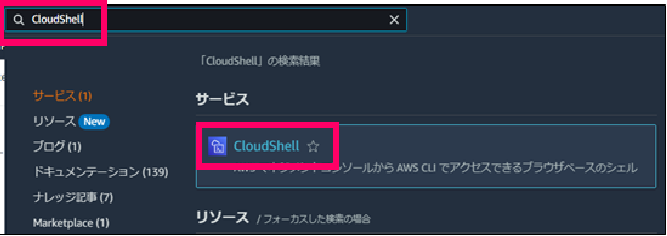

<!-- omit in toc -->
# 2023-01-16  ConfigRules情報収集

## 1. ドキュメント作成者

DTS 塩田

## 2. 改訂履歴

- 1.0:
  - 作成日時: 2023-01-16
  - 更新内容: 初版作成

## 3. このドキュメントの目次

- [1. ドキュメント作成者](#1-ドキュメント作成者)
- [2. 改訂履歴](#2-改訂履歴)
- [3. このドキュメントの目次](#3-このドキュメントの目次)
- [4. 前提条件](#4-前提条件)
- [5. 作業者](#5-作業者)
- [6. 副作業者 (チェッカー)](#6-副作業者-チェッカー)
- [7. その他制約事項・備考](#7-その他制約事項備考)
- [8. 参考情報](#8-参考情報)
- [9. 手順書](#9-手順書)
  - [9.1. ログイン \[想定作業時間: 3分\]](#91-ログイン-想定作業時間-3分)
  - [9.2. ConfigRules情報取得作業 \[想定作業時間: 5分\]](#92-configrules情報取得作業-想定作業時間-5分)

## 4. 前提条件

- Config適合パックが1件以上デプロイされていること。

## 5. 作業者

## 6. 副作業者 (チェッカー)

## 7. その他制約事項・備考

## 8. 参考情報


## 9. 手順書

### 9.1. ログイン [想定作業時間: 3分]

- [ ] [AWSマネージメントコンソールのURL](https://console.aws.amazon.com/console/home)をクリックする。
- [ ] 以下の必要な情報を入力して`サインイン`をクリックする。
  - [ ] アカウントID: `123456789012`
  - [ ] ユーザー名: `xxxxxxxx`
  - [ ] パスワード: `自分のIAMユーザーのパスワード`
- [ ] MFAコードを入力し、`送信`をクリックする。
- [ ] マネジメントコンソール上部に、**AWS マネジメントコンソール**を大きく表示されることを確認する。

### 9.2. ConfigRules情報取得作業 [想定作業時間: 5分]

- [ ] 「AWSマネジメントコンソール」画面上部のナビゲーションバーより「CloudShell」を検索し、CloudShellコンソール画面を表示する。  
  
  - [ ] CloudShellの画面が表示されることを確認する。  
  
- [ ] 「CloudShell」にて以下のコマンドを実行する。  
```txt
aws configservice describe-compliance-by-config-rule \
--query "ComplianceByConfigRules[].[\
ConfigRuleName,Compliance.ComplianceType,\
Compliance.ComplianceContributorCount.CappedCount,\
Compliance.ComplianceContributorCount.CapExceeded]" \
--compliance-types NON_COMPLIANT \
--output text | column -t  |grep conformance-pack > configrules.txt
```

  - [ ] エラーとならないことを確認する。
- [ ] 画面右上の「Actions」ボタンを押下し、「Download file」を押下する。
  - [ ] 「Download file」詳細画面が表示されることを確認する。
- [ ] 「Download file」詳細画面に「configrules.txt」を入力し、「Download」ボタンを押下する。
  - [ ] ダウンロードしたファイルが保存されていることを確認する。
  - [ ] ファイル名が「ConfigRules.txt」となっていること。
  
  ```txt
  ※「Download」ボタンを押下した際にエラーとなる場合、  
  configrules.txtの中身が空で0バイトとなっていること考えられます。  
  「cat」コマンドなどでconfigrules.txtファイルの中身をご確認ください。
  ```

- [ ] 保存したファイルを開いて確認する。ファイル名「ConfigRules.txt」を開く。
  - [ ] 選択した内容が保存されていることを確認する。
  - [ ] ファイル中に「NON_COMPLIAN」の文字が存在することを確認する。

